# Plotly 
[Plotly](http://www.plot.ly) is a cool, open-source project  ( [github](https://github.com/plotly) ) to help people get interactive plots online easily through a number of various programming languages. It's essentially brand new and I'm going to document how well it works with the popular ggplot2 package in R. This document will be updated as support for more geoms is added.

# Plotly and geoms
I'm going to test out different ggplot geoms to check for compatibility.  Most examples will be taken straight from [ggplot's docs website](http://docs.ggplot2.org/current/). The master list of geoms is at the botttom of this post. Some of the plots have minor errors.

## Installing Plot.ly
installing Plot.ly is easy. 

```r
# autoloads ggplot
library(devtools)
install_github("plotly", "ropensci")
signup("yourusername", "youremail@foo.bar")
```


```r
library(plotly)
```

```
## Loading required package: RCurl
## Loading required package: bitops
## Loading required package: RJSONIO
## Loading required package: ggplot2
```

```r
py <- plotly(username = "xysmas", key = plotly.key)
```


# the plots

## geom_abline, hline, vline


```r
coefs <- coef(lm(Sepal.Length ~ Petal.Width, data = iris))
p.iris <- ggplot(iris, aes(Petal.Width, Sepal.Length, color = Species))
p.iris <- p.iris + geom_point()
p.iris.hline <- p.iris + geom_hline(yintercept = 7)
p.iris.abline <- p.iris + geom_abline(intercept = coefs[1], slope = coefs[2], 
    colour = "red", size = 2)
p.iris.vline <- p.iris + geom_vline(xintercept = 2)
p.iris.abline
p.iris.hline
p.iris.vline
```

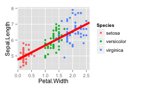


```r
py$ggplotly(p.iris.abline)
```

```
## Error: conversion not implemented for geom_abline (basic geom_abline)
```

```r
# odd little error
py$ggplotly(p.iris.hline)
```

```
## Error: object 'Petal.Width' not found
```

```r
# odd little error
py$ggplotly(p.iris.vline)
```

```
## Error: object 'Petal.Width' not found
```

geom_abline doesn't work. 

## geom_area

```r
# Generate data
huron <- data.frame(year = 1875:1972, level = as.vector(LakeHuron))
library(plyr)  # to access round_any
huron$decade <- round_any(huron$year, 10, floor)

h <- ggplot(huron, aes(x = year))
h <- h + geom_area(aes(y = level))
h
```

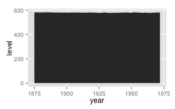


```r
py$ggplotly(h)
```

```
## Error: conversion not implemented for geom_area (basic geom_area)
```

geom_area = FALSE!

## geom_bar

```r
bar <- ggplot(iris, aes(Species, colour = Species, fill = Species))
bar <- bar + geom_bar()
bar
```

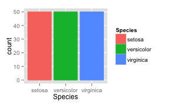


```r
py$ggplotly(bar)
```

```
## Error: conversion not implemented for geom_bar (basic geom_bar)
```


Nope.

## geom_bin2d

```r
d <- ggplot(diamonds, aes(x = x, y = y)) + xlim(4, 10) + ylim(4, 10)
d <- d + geom_bin2d()
py$ggplotly(d)
```

```
## Error: conversion not implemented for geom_bin2d (basic geom_bin2d)
```


Nope. 

## geom_boxplot

```r
p.iris <- ggplot(iris, aes(Species, Sepal.Length, fill = Species))
p.iris <- p.iris + geom_boxplot()
py$ggplotly(p.iris)
```

```
## Error: conversion not implemented for geom_boxplot (basic geom_boxplot)
```


Nope. 


## geom_contour

```r
library(reshape2)
volcano3d <- melt(volcano)
colnames(volcano3d) <- c("x", "y", "z")
p <- ggplot(volcano3d, aes(x, y, z = z)) + geom_contour()
py$ggplotly(p)
```

```
## Error: conversion not implemented for geom_contour (basic geom_contour)
```


Nope.

## geom_crossbar, linerange, pointrange, and errorbar

```r
# From ggplot example: Generate data: means and standard errors of means for
# prices for each type of cut
dmod <- lm(price ~ cut, data = diamonds)
cuts <- data.frame(cut = unique(diamonds$cut), predict(dmod, data.frame(cut = unique(diamonds$cut)), 
    se = TRUE)[c("fit", "se.fit")])
# Display estimates and standard errors in various ways
se <- ggplot(cuts, aes(cut, fit, ymin = fit - se.fit, ymax = fit + se.fit, colour = cut))
se + geom_linerange()
se + geom_pointrange()
se + geom_crossbar()
py$ggplotly(se + geom_linerange())
```

```
## Error: conversion not implemented for geom_linerange (basic
## geom_linerange)
```

```r
py$ggplotly(se + geom_pointrange())
```

```
## Error: conversion not implemented for geom_pointrange (basic
## geom_pointrange)
```

```r
py$ggplotly(se + geom_crossbar())
```

```
## Error: conversion not implemented for geom_crossbar (basic geom_crossbar)
```

```r
py$ggplotly(se + geom_errorbar())
```

```
## Error: conversion not implemented for geom_errorbar (basic geom_errorbar)
```

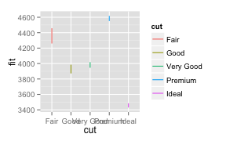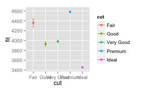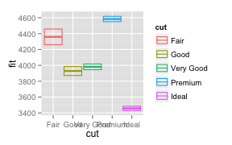


Nope. 

## geom_density/2d

```r
p <- ggplot(iris, aes(Sepal.Width, fill = Species, group = Species))
p + geom_density(alpha = 0.5)
py$ggplotly(p + geom_density(alpha = 0.5))
```

```
## Error: conversion not implemented for geom_density (basic geom_density)
```

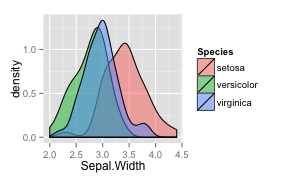

nope.

## geom_dotplot

```r
p + geom_dotplot(binwidth = 0.1)
py$ggplotly(p + geom_dotplot(binwidth = 0.1))
```

```
## Error: conversion not implemented for geom_dotplot (basic geom_dotplot)
```


no. 


## geom_freqpoly


```r
p + geom_freqpoly()
```

```
## stat_bin: binwidth defaulted to range/30. Use 'binwidth = x' to adjust this.
```

```r
py$ggplotly(p + geom_freqpoly())
```

```
## stat_bin: binwidth defaulted to range/30. Use 'binwidth = x' to adjust this.
## stat_bin: binwidth defaulted to range/30. Use 'binwidth = x' to adjust this.
## stat_bin: binwidth defaulted to range/30. Use 'binwidth = x' to adjust this.
```

```
## Error: conversion not implemented for geom_freqpoly (basic geom_freqpoly)
```

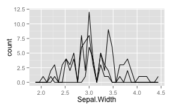

no. 

## geom_hex

```r
p <- ggplot(iris, aes(Sepal.Width, Petal.Length, fill = Species, group = Species))
p + geom_hex()
```

```
## Error: argument is of length zero
```


## geom_histogram

```r
p <- ggplot(iris, aes(Sepal.Width, fill = Species, group = Species))
p + geom_histogram()
```

```
## stat_bin: binwidth defaulted to range/30. Use 'binwidth = x' to adjust this.
```

```
## Warning: position_stack requires constant width: output may be incorrect
```

```r
py$ggplotly(p + geom_histogram())
```

```
## Warning: position_stack requires constant width: output may be incorrect
```

```
## stat_bin: binwidth defaulted to range/30. Use 'binwidth = x' to adjust this.
```

```
## Warning: position_stack requires constant width: output may be incorrect
```

```
## stat_bin: binwidth defaulted to range/30. Use 'binwidth = x' to adjust this.
```

```
## Warning: position_stack requires constant width: output may be incorrect
```

```
## stat_bin: binwidth defaulted to range/30. Use 'binwidth = x' to adjust this.
```

```
## Warning: position_stack requires constant width: output may be incorrect
```

```
## Error: conversion not implemented for geom_histogram (basic
## geom_histogram)
```

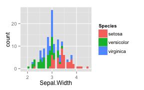

no.


##  geom_jitter

```r
p <- ggplot(iris, aes(Petal.Width, Sepal.Length, color = Species))
p + geom_jitter()
py$ggplotly(p + geom_jitter())
```

```
## Error: conversion not implemented for geom_jitter (basic geom_jitter)
```

```r
# try position instead
py$ggplotly(p + geom_point(position = position_jitter()))
```

<iframe height="600" id="igraph" scrolling="no" seamless="seamless"
				src="https://plot.ly/~xysmas/161" width="600"></iframe>

geom_jitter fails, but position jitter passed to geompoint seems to work fine. 

## geom_line
(potentially the most useless plot ever, but just as an example...)

```r
p <- p + geom_line()
p
```

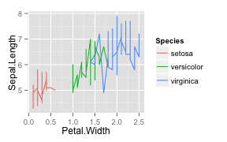<iframe height="600" id="igraph" scrolling="no" seamless="seamless"
				src="https://plot.ly/~xysmas/161" width="600"></iframe>


```r
py$ggplotly(p)
```

<iframe height="600" id="igraph" scrolling="no" seamless="seamless"
				src="https://plot.ly/~xysmas/162" width="600"></iframe>

yes, funny that abline and the other line geoms do not work.

## geom_map 
straight from ggplot docs:

```r
crimes <- data.frame(state = tolower(rownames(USArrests)), USArrests)
library(reshape2)  # for melt
library(maps)
crimesm <- melt(crimes, id = 1)
states_map <- map_data("state")
crimemap <- ggplot(crimes, aes(map_id = state)) + geom_map(aes(fill = Murder), 
    map = states_map) + expand_limits(x = states_map$long, y = states_map$lat)

crimemap.coordmap <- last_plot() + coord_map()

crimemap.facet <- ggplot(crimesm, aes(map_id = state)) + geom_map(aes(fill = value), 
    map = states_map) + expand_limits(x = states_map$long, y = states_map$lat) + 
    facet_wrap(~variable)


# When using geom_polygon, you will typically need two data frames: one
# contains the coordinates of each polygon (positions), and the other the
# values associated with each polygon (values).  An id variable links the
# two together

ids <- factor(c("1.1", "2.1", "1.2", "2.2", "1.3", "2.3"))

values <- data.frame(id = ids, value = c(3, 3.1, 3.1, 3.2, 3.15, 3.5))

positions <- data.frame(id = rep(ids, each = 4), x = c(2, 1, 1.1, 2.2, 1, 0, 
    0.3, 1.1, 2.2, 1.1, 1.2, 2.5, 1.1, 0.3, 0.5, 1.2, 2.5, 1.2, 1.3, 2.7, 1.2, 
    0.5, 0.6, 1.3), y = c(-0.5, 0, 1, 0.5, 0, 0.5, 1.5, 1, 0.5, 1, 2.1, 1.7, 
    1, 1.5, 2.2, 2.1, 1.7, 2.1, 3.2, 2.8, 2.1, 2.2, 3.3, 3.2))

test <- ggplot(values) + geom_map(aes(map_id = id), map = positions) + expand_limits(positions)
```

<iframe height="600" id="igraph" scrolling="no" seamless="seamless"
				src="https://plot.ly/~xysmas/162" width="600"></iframe>


```r
py$ggplotly(test)
```

```
## Error: conversion not implemented for geom_map (basic geom_map)
```

```r
py$ggplotly(crimemap.facet)
```

```
## Error: object 'state' not found
```

```r
py$ggplotly(ggplot(crimes, aes(map_id = state)) + geom_map(aes(fill = Murder), 
    map = states_map) + expand_limits(x = states_map$long, y = states_map$lat))
```

```
## Error: object 'state' not found
```

<iframe height="600" id="igraph" scrolling="no" seamless="seamless"
				src="https://plot.ly/~xysmas/162" width="600"></iframe>

no maps.


## geom_path


```r
# Use the arrow parameter to add an arrow to the line See ?grid::arrow for
# more details
library(grid)
c <- ggplot(economics, aes(x = date, y = pop))
# Arrow defaults to 'last'
c + geom_path(arrow = arrow())
py$ggplotly(c + geom_path(arrow = arrow()))
```

<iframe height="600" id="igraph" scrolling="no" seamless="seamless"
				src="https://plot.ly/~xysmas/163" width="600"></iframe>

success!

## geom_point
Clearly this works.


## geom_polygon
I"m guessing that since the map, which uses polygon, didn't work, this probably won't either. Stolen example from ggplot docs. 

```r
# When using geom_polygon, you will typically need two data frames: one
# contains the coordinates of each polygon (positions), and the other the
# values associated with each polygon (values).  An id variable links the
# two together

ids <- factor(c("1.1", "2.1", "1.2", "2.2", "1.3", "2.3"))

values <- data.frame(id = ids, value = c(3, 3.1, 3.1, 3.2, 3.15, 3.5))

positions <- data.frame(id = rep(ids, each = 4), x = c(2, 1, 1.1, 2.2, 1, 0, 
    0.3, 1.1, 2.2, 1.1, 1.2, 2.5, 1.1, 0.3, 0.5, 1.2, 2.5, 1.2, 1.3, 2.7, 1.2, 
    0.5, 0.6, 1.3), y = c(-0.5, 0, 1, 0.5, 0, 0.5, 1.5, 1, 0.5, 1, 2.1, 1.7, 
    1, 1.5, 2.2, 2.1, 1.7, 2.1, 3.2, 2.8, 2.1, 2.2, 3.3, 3.2))

# Currently we need to manually merge the two together
datapoly <- merge(values, positions, by = c("id"))

(p <- ggplot(datapoly, aes(x = x, y = y)) + geom_polygon(aes(fill = value, group = id)))
py$ggplotly(p)
rm(p)
```

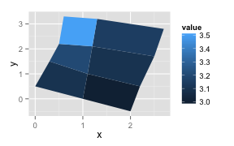<iframe height="600" id="igraph" scrolling="no" seamless="seamless"
				src="https://plot.ly/~xysmas/164" width="600"></iframe>


Wrong, it works.

##geom_quantile /stat_quantile

```r
msamp <- movies[sample(nrow(movies), 1000), ]
q10 <- seq(0.05, 0.95, by = 0.05)
m <- ggplot(msamp, aes(year, rating)) + geom_point()
m <- m + stat_quantile(aes(colour = ..quantile..), quantiles = q10) + scale_colour_gradient2(midpoint = 0.5)
m
```

```
## Smoothing formula not specified. Using: y ~ x
```

```
## Warning: Solution may be nonunique
```

```r
py$ggplotly(m)
```

```
## Warning: Solution may be nonunique
```

```
## Smoothing formula not specified. Using: y ~ x
```

```
## Warning: Solution may be nonunique
```

```
## Smoothing formula not specified. Using: y ~ x
```

```
## Warning: Solution may be nonunique
```

```
## Smoothing formula not specified. Using: y ~ x
```

```
## Warning: Solution may be nonunique
```

```
## Smoothing formula not specified. Using: y ~ x
```

```
## Warning: Solution may be nonunique
```

```
## Smoothing formula not specified. Using: y ~ x
```

```
## Warning: Solution may be nonunique
```

```
## Error: conversion not implemented for geom_quantile (basic geom_quantile)
```

<iframe height="600" id="igraph" scrolling="no" seamless="seamless"
				src="https://plot.ly/~xysmas/164" width="600"></iframe>

no. 


## geom_raster
Example taken from ggplot docs

```r
# Generate data
pp <- function(n, r = 4) {
    x <- seq(-r * pi, r * pi, len = n)
    df <- expand.grid(x = x, y = x)
    df$r <- sqrt(df$x^2 + df$y^2)
    df$z <- cos(df$r^2) * exp(-df$r/6)
    df
}
raster <- qplot(x, y, data = pp(20), fill = z, geom = "raster")
raster
py$ggplotly(raster)
```

```
## Error: conversion not implemented for geom_raster (basic geom_raster)
```

<iframe height="600" id="igraph" scrolling="no" seamless="seamless"
				src="https://plot.ly/~xysmas/164" width="600"></iframe>

no. 

## geom_rect

```r
df <- data.frame(x = sample(10, 20, replace = TRUE), y = sample(10, 20, replace = TRUE))
p <- ggplot(df, aes(xmin = x, xmax = x + 1, ymin = y, ymax = y + 2))
p <- p + geom_rect()
p
py$ggplotly(p)
```

```
## Error: conversion not implemented for geom_rect (basic geom_rect)
```

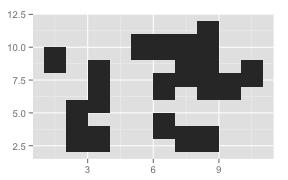<iframe height="600" id="igraph" scrolling="no" seamless="seamless"
				src="https://plot.ly/~xysmas/164" width="600"></iframe>


No. 

## geom_ribbon

```r
msamp <- movies[sample(nrow(movies), 1000), ]
m <- ggplot(msamp, aes(y = log(votes), x = year))
m <- m + geom_point()
m <- m + stat_summary(geom = "ribbon", fun.ymin = "min", fun.ymax = "max")
m
py$ggplotly(m)
```

```
## Error: TODO
```

<iframe height="600" id="igraph" scrolling="no" seamless="seamless"
				src="https://plot.ly/~xysmas/164" width="600"></iframe>


Points work, stat summary doesn't. 

## geom_rug

```r
msamp <- movies[sample(nrow(movies), 1000), ]
p <- ggplot(msamp, aes(year, log(votes)))
p <- p + geom_point()
(p <- p + geom_rug())
py$ggplotly(p)
```

```
## Error: conversion not implemented for geom_rug (basic geom_rug)
```

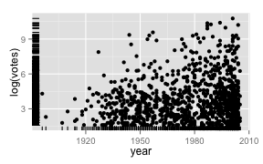<iframe height="600" id="igraph" scrolling="no" seamless="seamless"
				src="https://plot.ly/~xysmas/164" width="600"></iframe>


No.

## geom_segment
example from ggplot docs

```r
library(grid)  # needed for arrow function
p <- ggplot(seals, aes(x = long, y = lat))
p <- p + geom_segment(aes(xend = long + delta_long, yend = lat + delta_lat), 
    arrow = arrow(length = unit(0.1, "cm")))
p
py$ggplotly(p)
```

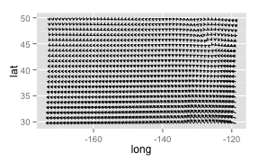<iframe height="600" id="igraph" scrolling="no" seamless="seamless"
				src="https://plot.ly/~xysmas/165" width="600"></iframe>


## geom_smooth

```r
p <- ggplot(mtcars, aes(wt, mpg, color = factor(cyl)))
p <- p + geom_point()
p <- p + geom_smooth()
p
```

```
## geom_smooth: method="auto" and size of largest group is <1000, so using loess. Use 'method = x' to change the smoothing method.
```

```r
py$ggplotly(p)
```

```
## geom_smooth: method="auto" and size of largest group is <1000, so using loess. Use 'method = x' to change the smoothing method.
## geom_smooth: method="auto" and size of largest group is <1000, so using loess. Use 'method = x' to change the smoothing method.
## geom_smooth: method="auto" and size of largest group is <1000, so using loess. Use 'method = x' to change the smoothing method.
## geom_smooth: method="auto" and size of largest group is <1000, so using loess. Use 'method = x' to change the smoothing method.
## geom_smooth: method="auto" and size of largest group is <1000, so using loess. Use 'method = x' to change the smoothing method.
```

```
## Error: conversion not implemented for geom_smooth (basic geom_smooth)
```

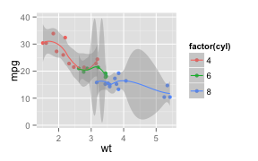<iframe height="600" id="igraph" scrolling="no" seamless="seamless"
				src="https://plot.ly/~xysmas/165" width="600"></iframe>

No smoothing.


## geom_step
Example straight from ggplot docs

```r
# Also works with other aesthetics
df <- data.frame(x = sort(rnorm(50)), trt = sample(c("a", "b"), 50, rep = TRUE))
p <- qplot(seq_along(x), x, data = df, geom = "step", colour = trt)
p
py$ggplotly(p)
```

```
## Error: conversion not implemented for geom_step (basic geom_step)
```

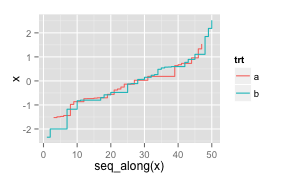<iframe height="600" id="igraph" scrolling="no" seamless="seamless"
				src="https://plot.ly/~xysmas/165" width="600"></iframe>


No.

## geom_text

```r
p <- ggplot(iris, aes(Petal.Width, Sepal.Length, label = Species, colour = Species))
p <- p + geom_point()
p <- p + geom_text(angle = 45)
p <- p + geom_text(data = NULL, x = 0.5, y = 7.2, label = "plotly is cool")
p
py$ggplotly(p)
```

```
## Error: conversion not implemented for geom_text (basic geom_text)
```

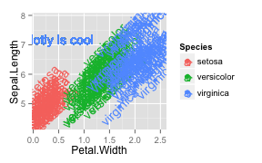<iframe height="600" id="igraph" scrolling="no" seamless="seamless"
				src="https://plot.ly/~xysmas/165" width="600"></iframe>

No.


## geom_tile

```r
# Generate data
pp <- function(n, r = 4) {
    x <- seq(-r * pi, r * pi, len = n)
    df <- expand.grid(x = x, y = x)
    df$r <- sqrt(df$x^2 + df$y^2)
    df$z <- cos(df$r^2) * exp(-df$r/6)
    df
}
p <- ggplot(pp(20), aes(x = x, y = y))
p <- p + geom_tile(aes(fill = z))
p
py$ggplotly(p)
```

```
## Error: conversion not implemented for geom_tile (basic geom_tile)
```

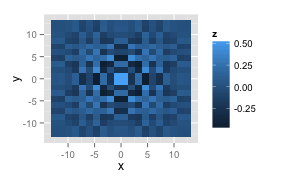<iframe height="600" id="igraph" scrolling="no" seamless="seamless"
				src="https://plot.ly/~xysmas/165" width="600"></iframe>

No.

## geom_violin

```r
p <- ggplot(mtcars, aes(factor(cyl), wt, fill = factor(cyl)))
p <- p + geom_violin()
p
py$ggplotly(p)
```

```
## Error: conversion not implemented for geom_violin (basic geom_violin)
```

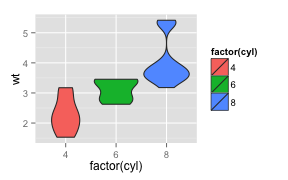<iframe height="600" id="igraph" scrolling="no" seamless="seamless"
				src="https://plot.ly/~xysmas/165" width="600"></iframe>

No.


# master list of geoms:
[ggplot2 docs](http://docs.ggplot2.org/current/)

### geoms
* geom_abline() = FALSE
* geom_area() = FALSE
* geom_bar() = FALSE
* geom_bin2d() = FALSE
* geom_blank() = 
* geom_boxplot() = FALSE
* geom_contour() = FALSE
* geom_crossbar() = FALSE
* geom_density() = FALSE
* geom_density2d() = FALSE
* geom_dotplot() = FALSE
* geom_errorbar() = FALSE
* geom_errorbarh() = FALSE
* geom_freqpoly() = FALSE
* geom_hex() = Untested
* geom_histogram() = FALSE
* geom_hline() = FALSE
* geom_jitter() = FALSE
* geom_line() = TRUE
* geom_linerange() = FALSE
* geom_map() = FALSE
* geom_path() = TRUE
* geom_point() = TRUE
* geom_pointrange() = FALSE
* geom_polygon() =TRUE 
* geom_quantile() = FALSE
* geom_raster() = FALSE
* geom_rect() = FALSE
* geom_ribbon() = FALSE
* geom_rug() = FALSE
* geom_segment() = TRUE
* geom_smooth() = FALSE
* geom_step() = FALSE
* geom_text() = FALSE
* geom_tile() = FALSE
* geom_violin() = FALSE
* geom_vline() = FALSE

### stats 
* stat_abline() = FALSE
* stat_bin()
* stat_bin2d()
* stat_bindot()
* stat_bindot()
* stat_binhex()
* stat_contour()
* stat_density()
* stat_density2d()
* stat_ecdf()
* stat_function()
* stat_hline()
* stat_identity()
* stat_qq()
* stat_quantile() = false
* stat_smooth()
* stat_spoke()
* stat_sum()
* stat_summary()
* stat_summary_hex()
* stat_summary2d()
* stat_unique()
* stat_vline()
* stat_ydensity()

### other ggplot stuff
* expand_limits
* guide_legend
* guide_colourbar(guide_colorbar)
* scale_alpha(scale_alpha_continuous, scale_alpha_discrete)
* scale_area()
* scale_color_brewer
* scale_color_continuous
* scale_color_discrete
* scale_color_gradient
* scale_color_gradient2
* scale_color_gradientn

* coord_cartesian
* coord_equal
* coord_fixed
* coord_flip
* coord_map = FALSE
* coord_polar
* coord_trans
* 
* facet_grid
* facet_null
* facet_wrap
* 
* position_dodge
* position_fill
* position_identity
* position_jitter
* position_stack


