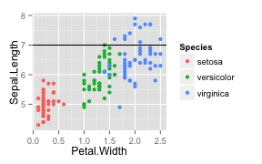
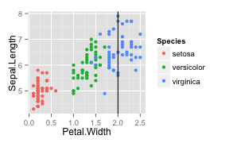
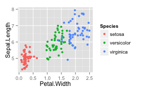
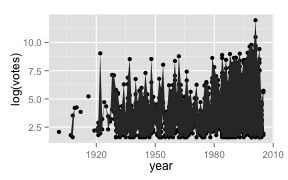

---
output:
  html_document:
    fig_caption: yes
    fig_height: 2.5
    fig_width: 4
    highlight: zenburn
    toc: yes
---


# Plotly, ggplot2, and R
[Plotly](http://www.plot.ly) is a cool, open-source project  ( [github](https://github.com/plotly) ) to help people get interactive plots online easily through a number of various programming languages. This page serves as a guide to using it with [R's](http://www.r-project.org/) [ggplot2](http://ggplot2.org/) visualization and plotting package and will be updated as support for new geoms (ggplot plots/visualization types) are added.

Most examples will be taken straight from [ggplot's docs website](http://docs.ggplot2.org/current/). The master list of geoms is at the botttom of this post. Some of the plots have minor errors.

## Installing Plot.ly
Installing Plot.ly within R is easy. 


```r
# autoloads ggplot
library(devtools)
install_github("plotly", "ropensci")
signup("yourusername", "youremail@foo.bar")
```


```r
library(plotly)
```

```
## Loading required package: RCurl
## Loading required package: bitops
## Loading required package: RJSONIO
## Loading required package: ggplot2
```

```r
py <- plotly(username = "xysmas", key = plotly.key)
```


# On With the Plots

<<<<<<< HEAD
=======
## geom_abline, hline, vline


```r
coefs <- coef(lm(Sepal.Length ~ Petal.Width, data = iris))
p.iris <- ggplot(iris, aes(Petal.Width, Sepal.Length, color = Species))
p.iris <- p.iris + geom_point()
p.iris.hline <- p.iris + geom_hline(yintercept = 7)
p.iris.abline <- p.iris + geom_abline(intercept = coefs[1], slope = coefs[2], 
    colour = "red", size = 2)
p.iris.vline <- p.iris + geom_vline(xintercept = 2)
p.iris.abline
p.iris.hline
p.iris.vline
```




```r
py$ggplotly(p.iris.abline)
```

```
## Error: conversion not implemented for geom_abline (basic geom_abline)
```

```r
# odd little error
py$ggplotly(p.iris.hline)
```

```
## Error: object 'Petal.Width' not found
```

```r
# odd little error
py$ggplotly(p.iris.vline)
```

```
## Error: object 'Petal.Width' not found
```

geom_abline doesn't work. 


>>>>>>> FETCH_HEAD
##  geom_jitter

```r
p <- ggplot(iris, aes(Petal.Width, Sepal.Length, color = Species))
p + geom_jitter()
py$ggplotly(p + geom_jitter())
```

```
## Error: conversion not implemented for geom_jitter (basic geom_jitter)
```

```r
# try position instead
py$ggplotly(p + geom_point(position = position_jitter()))
```

<iframe height="600" id="igraph" scrolling="no" seamless="seamless"
<<<<<<< HEAD
				src="https://plot.ly/~xysmas/192" width="600"></iframe>
=======
				src="https://plot.ly/~xysmas/183" width="600"></iframe>
>>>>>>> FETCH_HEAD

geom_jitter fails, but position jitter passed to geompoint seems to work fine. 

## geom_line
(potentially the most useless plot ever, but just as an example...)

```r
p <- p + geom_line()
p
```

<iframe height="600" id="igraph" scrolling="no" seamless="seamless"
<<<<<<< HEAD
				src="https://plot.ly/~xysmas/192" width="600"></iframe>
=======
				src="https://plot.ly/~xysmas/183" width="600"></iframe>
>>>>>>> FETCH_HEAD


```r
py$ggplotly(p)
```

<iframe height="600" id="igraph" scrolling="no" seamless="seamless"
<<<<<<< HEAD
				src="https://plot.ly/~xysmas/193" width="600"></iframe>
=======
				src="https://plot.ly/~xysmas/184" width="600"></iframe>
>>>>>>> FETCH_HEAD

yes, funny that abline and the other line geoms do not work.


<<<<<<< HEAD
=======
## geom_path


```r
# Use the arrow parameter to add an arrow to the line See ?grid::arrow for
# more details
library(grid)
c <- ggplot(economics, aes(x = date, y = pop))
# Arrow defaults to 'last'
c + geom_path(arrow = arrow())
py$ggplotly(c + geom_path(arrow = arrow()))
```

<iframe height="600" id="igraph" scrolling="no" seamless="seamless"
				src="https://plot.ly/~xysmas/185" width="600"></iframe>

>>>>>>> FETCH_HEAD

## geom_point
Clearly this works.


## geom_polygon

```r
### example straight from ggplot2 When using geom_polygon, you will typically
### need two data frames: one contains the coordinates of each polygon
### (positions), and the other the values associated with each polygon
### (values).  An id variable links the two together

ids <- factor(c("1.1", "2.1", "1.2", "2.2", "1.3", "2.3"))

values <- data.frame(id = ids, value = c(3, 3.1, 3.1, 3.2, 3.15, 3.5))

positions <- data.frame(id = rep(ids, each = 4), x = c(2, 1, 1.1, 2.2, 1, 0, 
    0.3, 1.1, 2.2, 1.1, 1.2, 2.5, 1.1, 0.3, 0.5, 1.2, 2.5, 1.2, 1.3, 2.7, 1.2, 
    0.5, 0.6, 1.3), y = c(-0.5, 0, 1, 0.5, 0, 0.5, 1.5, 1, 0.5, 1, 2.1, 1.7, 
    1, 1.5, 2.2, 2.1, 1.7, 2.1, 3.2, 2.8, 2.1, 2.2, 3.3, 3.2))

# Currently we need to manually merge the two together
datapoly <- merge(values, positions, by = c("id"))

(p <- ggplot(datapoly, aes(x = x, y = y)) + geom_polygon(aes(fill = value, group = id)))
py$ggplotly(p)
rm(p)
```

<iframe height="600" id="igraph" scrolling="no" seamless="seamless"
<<<<<<< HEAD
				src="https://plot.ly/~xysmas/194" width="600"></iframe>


=======
				src="https://plot.ly/~xysmas/186" width="600"></iframe>


## geom_ribbon

```r
msamp <- movies[sample(nrow(movies), 1000), ]
m <- ggplot(msamp, aes(y = log(votes), x = year))
m <- m + geom_point()
m <- m + stat_summary(geom = "ribbon", fun.ymin = "min", fun.ymax = "max")
m
py$ggplotly(m)
```

```
## Error: TODO
```

<iframe height="600" id="igraph" scrolling="no" seamless="seamless"
				src="https://plot.ly/~xysmas/186" width="600"></iframe>


Points work, stat summary doesn't. 
>>>>>>> FETCH_HEAD


## geom_segment
example from ggplot docs

```r
library(grid)  # needed for arrow function
p <- ggplot(seals, aes(x = long, y = lat))
p <- p + geom_segment(aes(xend = long + delta_long, yend = lat + delta_lat), 
    arrow = arrow(length = unit(0.1, "cm")))
p
py$ggplotly(p)
```

<iframe height="600" id="igraph" scrolling="no" seamless="seamless"
<<<<<<< HEAD
				src="https://plot.ly/~xysmas/195" width="600"></iframe>
=======
				src="https://plot.ly/~xysmas/187" width="600"></iframe>
>>>>>>> FETCH_HEAD


# master list of geoms:
[ggplot2 docs](http://docs.ggplot2.org/current/)

### geoms
* geom_abline() = FALSE
* geom_area() = FALSE
* geom_bar() = FALSE
* geom_bin2d() = FALSE
* geom_blank() = 
* geom_boxplot() = FALSE
* geom_contour() = FALSE
* geom_crossbar() = FALSE
* geom_density() = FALSE
* geom_density2d() = FALSE
* geom_dotplot() = FALSE
* geom_errorbar() = FALSE
* geom_errorbarh() = FALSE
* geom_freqpoly() = FALSE
* geom_hex() = Untested
* geom_histogram() = FALSE
* geom_hline() = FALSE
* geom_jitter() = FALSE
* geom_line() = TRUE
* geom_linerange() = FALSE
* geom_map() = FALSE
* geom_path() = TRUE
* geom_point() = TRUE
* geom_pointrange() = FALSE
* geom_polygon() =TRUE 
* geom_quantile() = FALSE
* geom_raster() = FALSE
* geom_rect() = FALSE
* geom_ribbon() = FALSE
* geom_rug() = FALSE
* geom_segment() = TRUE
* geom_smooth() = FALSE
* geom_step() = FALSE
* geom_text() = FALSE
* geom_tile() = FALSE
* geom_violin() = FALSE
* geom_vline() = FALSE

### stats 
* stat_abline() = FALSE
* stat_bin()
* stat_bin2d()
* stat_bindot()
* stat_bindot()
* stat_binhex()
* stat_contour()
* stat_density()
* stat_density2d()
* stat_ecdf()
* stat_function()
* stat_hline()
* stat_identity()
* stat_qq()
* stat_quantile() = false
* stat_smooth()
* stat_spoke()
* stat_sum()
* stat_summary()
* stat_summary_hex()
* stat_summary2d()
* stat_unique()
* stat_vline()
* stat_ydensity()

### other ggplot stuff
* expand_limits
* guide_legend
* guide_colourbar(guide_colorbar)
* scale_alpha(scale_alpha_continuous, scale_alpha_discrete)
* scale_area()
* scale_color_brewer
* scale_color_continuous
* scale_color_discrete
* scale_color_gradient
* scale_color_gradient2
* scale_color_gradientn

* coord_cartesian
* coord_equal
* coord_fixed
* coord_flip
* coord_map = FALSE
* coord_polar
* coord_trans
* 
* facet_grid
* facet_null
* facet_wrap
* 
* position_dodge
* position_fill
* position_identity
* position_jitter
* position_stack


